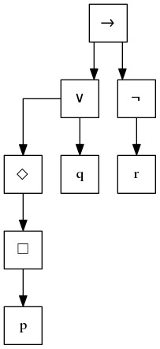

# ModLog

A modular logic (Kripke) parser and evaluator.

The project thusfar consists of 4 files:

- `data.py` which contains the datastructures for Kripke models and Logical Expressions
  - Note currently, the documentation for all the methods of Logical Expressions is in
    LogicExpression, which doesn't show in the normal help. e.g. `help(And.calc)`. For now
    use `help(LogicExpression.calc)`. **TODO FIX DOCUMENTATION INHERITENCE**
- `parser.py` which can parse arbitrary expressions to an interpreted form using the datastructures
  in `data.py`
- `tree.py` creates parse trees for expressions in the `.dot` extension
- `evaluator.py`, evaluator calculates whether a model satisfies an expression and if not, what worlds
  in the model do. Note that it requires a model (examples can be found in the examples folder)

Note that `parser.py`, `tree.py` and `evaluator.py` all respond to the `-h` and `--help` switch for
more specific information.

A tree as given by `tree.py`:

